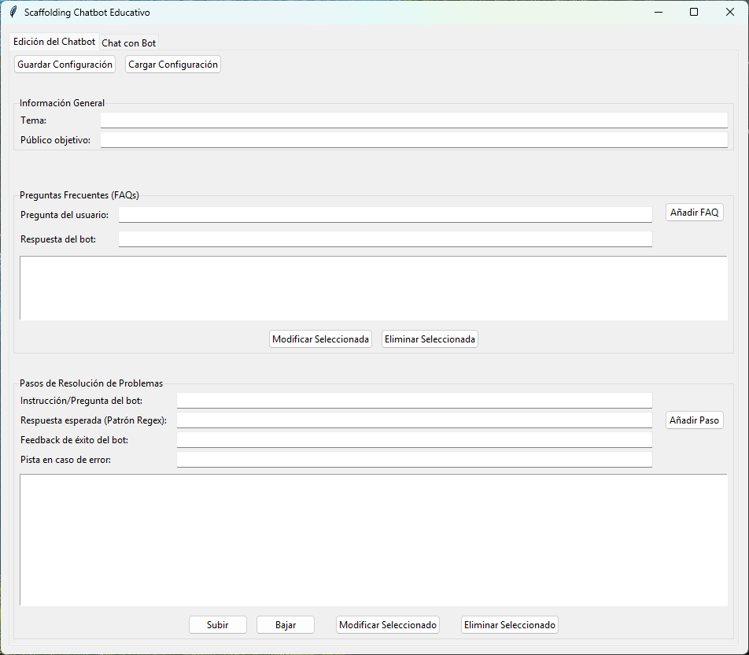

# 🤖 Scaffolding Chatbot Creator

¡Crea tus propios chatbots educativos de scaffolding sin escribir una sola línea de código! Esta herramienta te permite diseñar conversaciones guiadas paso a paso, ideales para tutorías, explicaciones de conceptos y ejercicios prácticos.

  <!-- Reemplaza esto con una URL de una captura de tu app. Súbela a imgur.com u otro servicio -->

---

## ✨ Características Principales

- **Editor Visual Intuitivo**: Define el comportamiento de tu chatbot a través de una sencilla interfaz gráfica. ¡No más código!
- **Sistema de Scaffolding**: Guía a los usuarios paso a paso a través de problemas complejos, ofreciendo pistas y feedback positivo.
- **FAQs Dinámicas**: Crea una sección de preguntas frecuentes que el bot puede responder de forma inteligente.
- **Configuraciones Guardables**: Guarda y carga diferentes "personalidades" de chatbot como archivos `.json`. ¡Crea un tutor para cada tema!
- **Interfaz de Chat Moderna**: Una ventana de chat atractiva con burbujas de diálogo que mejora la experiencia del usuario.
- **Selector de Tema Visual**: Cambia el aspecto de la aplicación fácilmente desde el botón de configuración, eligiendo entre varios estilos modernos.
- **Modo Solo Chatbot**: Puedes usar únicamente la ventana de chat del bot, sin el editor. Solo asegúrate de colocar tus archivos de configuración `.json` en la carpeta `configs` al mismo nivel que el ejecutable para que sean detectados.
- **Creación Automatizada**: Incluye un flujo de trabajo de GitHub Actions para generar automáticamente un ejecutable (`.exe`) para una fácil distribución.

## 🚀 Cómo Empezar

### Para Usuarios

1.  Ve a la sección de [**Releases**](https://github.com/tu-usuario/tu-repositorio/releases) de este repositorio. <!-- Reemplaza con tu URL -->
2.  Descarga el archivo `ScaffoldingChatbot.exe` de la última versión.
3.  Ejecuta el archivo. No necesita instalación.
4.  Dentro de la aplicación, haz clic en **"Cargar Configuración"** y selecciona uno de los archivos `.json` de ejemplo (`config_ecuaciones.json`, `config_leyes_newton.json`, etc.).
5.  Ve a la pestaña **"Chat con Bot"** y empieza a interactuar. ¡Prueba a escribir "practicar"!

### Solo Chatbot
1.  Si solo quieres usar el chatbot descarga el archivo `Chatbot.exe`. 
2.  Coloca tus archivos `.json` en la carpeta `configs` al mismo nivel que el ejecutable. 
3.  Ejecuta el `Chatbot.exe` y todo arraca.

### Para Desarrolladores

Si quieres modificar o ejecutar el código fuente:

1.  **Clona el repositorio:**
    ```bash
    git clone https://github.com/tu-usuario/tu-repositorio.git
    cd tu-repositorio
    ```

2.  **Crea un entorno virtual (recomendado):**
    ```bash
    python -m venv venv
    # En Windows
    venv\Scripts\activate
    # En macOS/Linux
    source venv/bin/activate
    ```

3.  **Instala las dependencias:**
    ```bash
    pip install -r requirements.txt
    ```

4.  **Ejecuta la aplicación:**
    ```bash
    python main.py
    ```

## 🛠️ Creando tu Propio Chatbot

La magia de esta herramienta reside en la pestaña **"Edición del Chatbot"**. Aquí puedes:

- **Definir el Tema y Público**: Dale un nombre y un contexto a tu chatbot.
- **Añadir FAQs**:
  - Escribe una pregunta común del usuario.
  - Escribe la respuesta que debe dar el bot.
  - El sistema creará automáticamente un patrón flexible para detectar la pregunta.
- **Crear Pasos de Resolución**:
  - **Instrucción**: Lo que el bot pregunta al usuario.
  - **Patrón Regex**: La respuesta esperada del usuario (usa expresiones regulares para flexibilidad).
  - **Feedback de Éxito**: Lo que el bot dice cuando el usuario acierta.
  - **Pista de Error**: La ayuda que el bot ofrece si el usuario se equivoca.
- **Gestionar Contenido**: Puedes **modificar**, **eliminar** y **reordenar** (subir/bajar) los pasos para perfeccionar el flujo de la conversación.
- **Personalizar el Tema Visual**: Usa el botón de configuración para elegir el estilo visual que prefieras.

Una vez que estés satisfecho, haz clic en **"Guardar Configuración"** para crear tu propio archivo `.json` y compartirlo.

## 📁 Estructura del Proyecto


├── .github/workflows/ # Flujos de trabajo de GitHub Actions

│ └── build-executable.yml

├── backend/ # Lógica del chatbot

│ └── chatbot_logic.py

│ └── persistence.py # Lógica para guardar/cargar archivos JSON

├── gui/ # Componentes de la interfaz gráfica

│ ├── chat_panel.py

│ └── scaffolding_app.py

├── assets/ # Iconos, imágenes, etc. (ej: icon.ico)

├── configs/ # Archivos de configuración de ejemplo

│ ├── config_ecuaciones.json

│ └── config_leyes_newton.json

├── main.py # Punto de entrada de la aplicación

└── requirements.txt # Dependencias de Python

## 🤝 Contribuciones

¡Las contribuciones son bienvenidas! Si tienes ideas para nuevas características, mejoras en la interfaz o correcciones de errores, por favor abre un [**Issue**](https://github.com/tu-usuario/tu-repositorio/issues) para discutirlo o envía un [**Pull Request**](https://github.com/tu-usuario/tu-repositorio/pulls).
